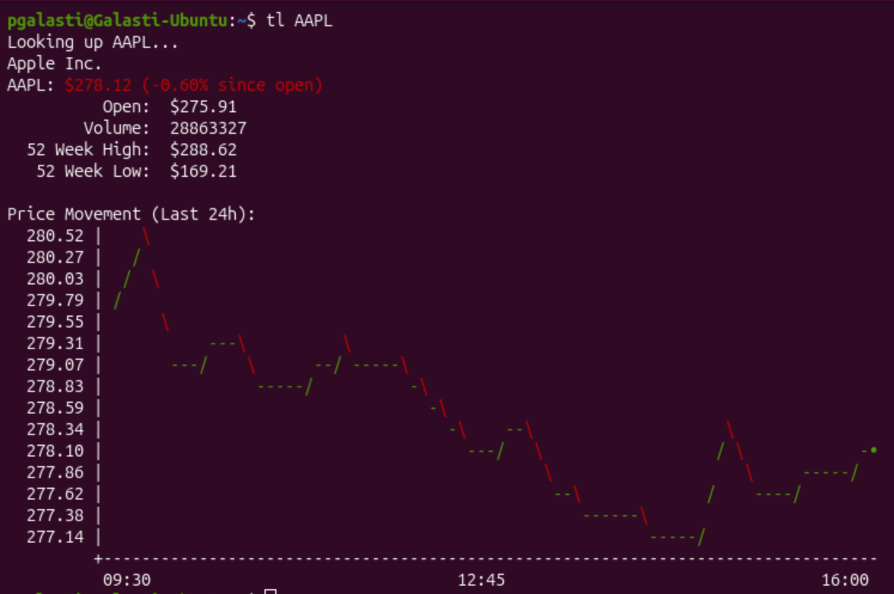

# Ticker Lookup

A simple CLI tool to look up stock prices and key statistics. It even has a pretty ASCII price chart directly in your terminal if you want.



## Prerequisites

To build and run this application, you need:

- **Java Development Kit (JDK) 17** or higher.
- **Apache Maven** (for dependency management and building).
- **Make** (standard on Linux/macOS, for using the provided Makefile).

## Building the Project

You can build the project using the provided `Makefile`:

```bash
make build
```

Alternatively, use Maven directly:

```bash
mvn package
```

This will generate a shaded (executable) JAR file in the `target/` directory.

## Installation

### TL;DR

```bash
make build && make install # You'll need sudo
```

### Details

You can install the tool system-wide so that the `tl` command is available from anywhere:

```bash
make install
```

_Note: This script will prompt for `sudo` privileges to copy the JAR to `/usr/local/share` and create a wrapper script in `/usr/local/bin`._

## Usage

### Basic Lookup

```bash
tl AAPL
```

### Options

- **Time Period:**
  Choose the chart/statistics window (mutually exclusive; defaults to the current day):

  | Flag    | Window        |
  | ------- | ------------- |
  | `-d`    | Current day (default) |
  | `-5d`   | Last 5 days   |
  | `-30d`  | Last 30 days  |
  | `-mtd`  | Month to date |
  | `-ytd`  | Year to date  |

  ```bash
  tl AAPL -30d
  ```

- **Omit the Chart:**
  Use `-sc=no` or `--showChart=no` to display only the statistics.

  ```bash
  tl TSLA --showChart=no
  ```

- **Help:**
  Display usage instructions.
  ```bash
  tl help
  ```

## License

Go crazy.
